# CrewAI Multi-Agent Content Generation System

## Architecture Diagram

```mermaid
flowchart TB
    subgraph Input["📥 Input Layer"]
        topic["Topic: 'Artificial Intelligence'"]
    end

    subgraph LLM["🧠 LLM Layer"]
        groq["Groq LLM<br/>llama-3.3-70b-versatile"]
    end

    subgraph Core["🎯 CORE ARCHITECTURE - Agents + Tasks"]

        subgraph AgentTask1["Agent-Task Pair 1"]
            planner["Planner Agent"]
            task1["Task 1: Content Plan"]
            planner -.->|"executes"| task1
        end

        subgraph AgentTask2["Agent-Task Pair 2"]
            writer["Writer Agent"]
            task2["Task 2: Write Blog Post"]
            writer -.->|"executes"| task2
        end

        subgraph AgentTask3["Agent-Task Pair 3"]
            editor["Editor Agent"]
            task3["Task 3: Edit & Proofread"]
            editor -.->|"executes"| task3
        end

    end

    subgraph Crew["⚙️ Crew Orchestrator"]
        crew["Crew: Sequential Execution<br/>agents=[planner, writer, editor]<br/>tasks=[plan, write, edit]"]
    end

    subgraph Output["📤 Output Layer"]
        result["Final Blog Post"]
    end

    topic --> Crew
    groq --> |"LLM Calls"| Core

    task1 --> |"Output → Input"| task2
    task2 --> |"Output → Input"| task3

    task3 --> result
```



---

## Component Explanation

### 1. **Input Layer**

- **Topic**: The user provides a topic (e.g., "Artificial Intelligence")
- This is passed to the Crew via `kickoff(inputs={"topic": "topic"})`

### 2. **LLM Layer**

- **Groq LLM**: Uses `llama-3.3-70b-versatile` model via Groq API
- API key loaded from environment variables (`GROQ_API_KEY`)
- All agents share the same LLM instance

### 3. **Agents + Tasks Layer (CORE)**

This is the **heart of the system** where each Agent is paired with a Task:

| Agent             | Executes Task                | Description                                                                       |
| ----------------- | ---------------------------- | --------------------------------------------------------------------------------- |
| **Planner Agent** | **Task 1: Content Plan**     | Researches trends, identifies audience, develops outline with SEO keywords        |
| **Writer Agent**  | **Task 2: Write Blog Post**  | Crafts blog post based on planner's outline with engaging intro, body, conclusion |
| **Editor Agent**  | **Task 3: Edit & Proofread** | Proofreads for grammar, style, and alignment with brand voice                     |

### 4. **Task Details**

| Task              | Agent   | Description                                                  | Expected Output                     |
| ----------------- | ------- | ------------------------------------------------------------ | ----------------------------------- |
| **Task 1: Plan**  | Planner | Research trends, identify audience, develop outline with SEO | Comprehensive content plan document |
| **Task 2: Write** | Writer  | Craft blog post with engaging intro, body, conclusion        | Well-written markdown blog post     |
| **Task 3: Edit**  | Editor  | Proofread for grammar and brand voice alignment              | Publication-ready markdown post     |

### 5. **Crew Orchestrator**

- **Crew** coordinates the agents and tasks
- **Sequential workflow**: Plan → Write → Edit
- Each task depends on the previous one's output

---

## Data Flow (Detailed with Tasks)

```
User Input (Topic)
    ↓
┌─────────────────────────────────────┐
│         CREW ORCHESTRATOR           │
│   agents=[planner, writer, editor]  │
│   tasks=[plan, write, edit]         │
└─────────────────────────────────────┘
    ↓
┌─────────────────────────────────────┐
│         TASK 1: CONTENT PLAN        │
│    (executed by Planner Agent)      │
│    - Research trends                │
│    - Identify audience              │
│    - Develop outline with SEO       │
└─────────────────────────────────────┘
    ↓ (output feeds into)
┌─────────────────────────────────────┐
│       TASK 2: WRITE BLOG POST       │
│     (executed by Writer Agent)      │
│     - Write content from outline    │
│     - Add engaging intro/conclusion │
└─────────────────────────────────────┘
    ↓ (output feeds into)
┌─────────────────────────────────────┐
│      TASK 3: EDIT & PROOFREAD      │
│     (executed by Editor Agent)      │
│     - Check grammar                 │
│     - Ensure brand voice            │
└─────────────────────────────────────┘
    ↓
    Final Blog Post
```

---

## Key Features

1. **Agent-Task Pairing**: Each task is explicitly assigned to a specific agent
2. **Sequential Processing**: Tasks execute in order (Plan → Write → Edit)
3. **LLM Integration**: Uses Groq's llama-3.3-70b-versatile for natural language processing
4. **No Delegation**: `allow_delegation=False` ensures each agent works independently
5. **Verbose Output**: Detailed logging for debugging and monitoring

---

## Dependencies

- `crewai>=1.9.3` - Multi-agent framework
- `crewai-tools>=1.9.3` - Additional tools for agents
- `langchain-groq>=1.1.2` - Groq LLM integration
- `python-dotenv>=1.1.1` - Environment variable management
